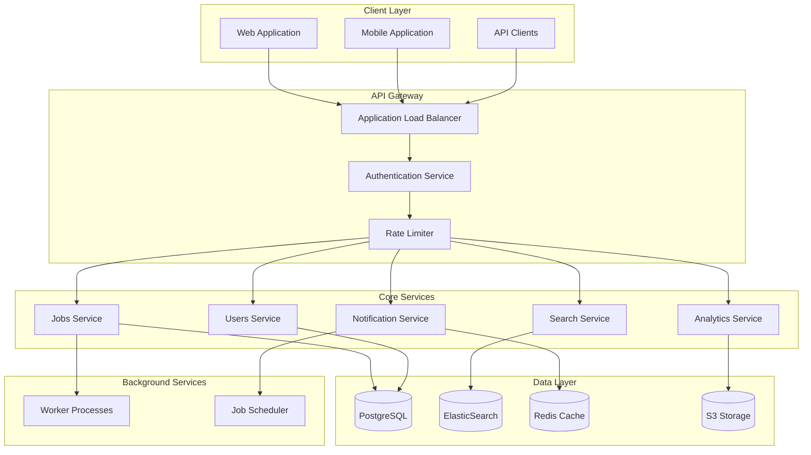

# System Architecture

This document outlines the technical architecture of the Job Portal platform, describing its components, interactions, and design decisions.

## System Overview

The Job Portal platform is built using a microservices architecture, emphasizing scalability, maintainability, and reliability. The system is designed to handle high concurrent users while maintaining data consistency and system performance.

## Architecture Diagram



## Technology Stack

### Frontend Technologies

- **Framework**: React.js with TypeScript
- **State Management**: Redux + Redux Toolkit
- **Styling**: Tailwind CSS
- **UI Components**: Custom component library
- **Testing**: Jest + React Testing Library
- **Build Tools**: Webpack, Babel

### Backend Technologies

- **API Framework**: Node.js + Express
- **Runtime**: Node.js LTS
- **Language**: TypeScript
- **API Documentation**: OpenAPI/Swagger
- **Testing**: Jest, Supertest

### Data Storage

- **Primary Database**: PostgreSQL
- **Search Engine**: Elasticsearch
- **Caching**: Redis
- **File Storage**: AWS S3
- **Message Queue**: RabbitMQ

### Infrastructure

- **Cloud Provider**: AWS
- **Container Orchestration**: Kubernetes
- **CI/CD**: GitHub Actions
- **Monitoring**: Prometheus + Grafana
- **Logging**: ELK Stack

## Core Components

### 1. API Gateway

```typescript
interface APIGateway {
  authentication: AuthenticationService;
  rateLimit: RateLimitingService;
  routing: RoutingService;
  logging: LoggingService;
}
```

Responsibilities:

- Request authentication and authorization
- Rate limiting and throttling
- Request routing and load balancing
- Request/response logging
- API versioning

### 2. Users Service

```typescript
interface UserService {
  profiles: ProfileManagement;
  authentication: AuthenticationManagement;
  authorization: AuthorizationManagement;
  preferences: PreferenceManagement;
}
```

Handles:

- User registration and authentication
- Profile management
- Role-based access control
- User preferences

### 3. Jobs Service

```typescript
interface JobService {
  posting: JobPostingManagement;
  applications: ApplicationManagement;
  search: JobSearchManagement;
  matching: JobMatchingService;
}
```

Manages:

- Job posting lifecycle
- Application processing
- Job search and filtering
- Job-candidate matching

### 4. Search Service

```typescript
interface SearchService {
  indexing: IndexingService;
  query: QueryService;
  ranking: RankingService;
  suggestions: SuggestionService;
}
```

Provides:

- Full-text search capabilities
- Advanced filtering
- Result ranking
- Search suggestions

### 5. Notification Service

```typescript
interface NotificationService {
  email: EmailService;
  push: PushNotificationService;
  inApp: InAppNotificationService;
  templates: NotificationTemplateService;
}
```

Handles:

- Email notifications
- Push notifications
- In-app notifications
- Notification preferences

## Data Models

### Core Entities

```typescript
interface User {
  id: string;
  type: "job_seeker" | "recruiter" | "admin";
  profile: UserProfile;
  preferences: UserPreferences;
  metadata: Metadata;
}

interface Job {
  id: string;
  company: Company;
  details: JobDetails;
  requirements: JobRequirements;
  status: JobStatus;
  metadata: Metadata;
}

interface Application {
  id: string;
  job: Job;
  applicant: User;
  status: ApplicationStatus;
  history: ApplicationHistory[];
  metadata: Metadata;
}
```

## Security Architecture

### Authentication

- JWT-based authentication
- OAuth2 integration
- Multi-factor authentication
- Session management

### Authorization

- Role-based access control (RBAC)
- Permission-based access control
- API key management
- Resource-level permissions

### Data Security

- Data encryption at rest
- TLS for data in transit
- Regular security audits
- Compliance monitoring

## Scalability and Performance

### Caching Strategy

- Multi-level caching
- Redis for session data
- CDN for static assets
- Query result caching

### Database Scaling

- Read replicas
- Horizontal sharding
- Connection pooling
- Query optimization

### Load Handling

- Auto-scaling groups
- Load balancing
- Rate limiting
- DDoS protection

## Monitoring and Observability

### Metrics Collection

- System metrics
- Business metrics
- User metrics
- Performance metrics

### Logging

- Structured logging
- Log aggregation
- Error tracking
- Audit logging

### Alerting

- Performance alerts
- Error alerts
- Security alerts
- Business alerts

## Deployment Architecture

### Development Environment

- Local development setup
- Testing environment
- Staging environment
- Production environment

### CI/CD Pipeline

1. Code commit
2. Automated tests
3. Build process
4. Security scanning
5. Deployment
6. Post-deployment validation

### Infrastructure as Code

- Terraform configurations
- Kubernetes manifests
- AWS CloudFormation
- Environment configurations

## System Boundaries

### External Integrations

- Email service providers
- Payment processors
- Analytics services
- Third-party APIs

### API Contracts

- RESTful API endpoints
- GraphQL schema
- WebSocket endpoints
- Webhook configurations

## Future Considerations

### Planned Improvements

- Microservices decomposition
- Event-driven architecture
- AI/ML integration
- Mobile app development

### Scalability Roadmap

- Global deployment
- Multi-region support
- Enhanced caching
- Performance optimization

## Additional Resources

- [API Documentation](../04-api-reference/authentication.md)
- [Deployment Guide](../07-guides/deployment.md)
- [Security Guidelines](../07-guides/security.md)
- [Best Practices](../07-guides/best-practices.md)
