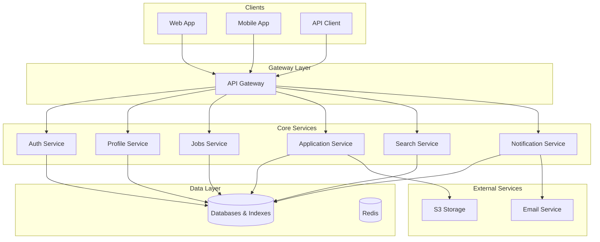

# Job Portal Microservice Architecture

## Architecture Overview

The Job Portal platform is built on a robust microservices architecture that enables scalability, resilience, and maintainability. Each service is designed with a specific domain responsibility and communicates with other services through a message queue system (NATS Streaming).

For detailed diagram see. [Jump Into Job ](https://www.mermaidchart.com/app/projects/b4dfb396-a323-446e-8038-574b7c8045d0/diagrams/7de523de-1366-44c1-8165-3f7a64a66d98/version/v0.1/edit)

## Core Microservices

### 1. Authentication Service

**Responsibility**: Manages user authentication and authorization across the platform.

**Features**:

- User registration and login
- JWT token generation and validation
- Role-based access control (job seekers, recruiters, admins)
- Password management
- OAuth integration with third-party providers
- Multi-factor authentication

**Database**: Authentication Database (User credentials, roles, permissions)

**Events Published**:

- `user.registered`
- `user.login`
- `user.password.reset`
- `user.role.changed`

**Events Consumed**:

- None

### 2. Profile Service

**Responsibility**: Manages user profiles for both job seekers and recruiters.

**Features**:

- Job seeker profile management (personal info, skills, experience)
- Multiple resume management
- Resume sharing and public profile
- Recruiter profile management
- Company profile management
- Profile privacy controls
- Profile scope settings (local/global)

**Database**: Profile Database (User profiles, resumes, professional information)

**Events Published**:

- `profile.created`
- `profile.updated`
- `resume.uploaded`
- `resume.shared`
- `company.profile.updated`

**Events Consumed**:

- `user.registered`

### 3. Jobs Service

**Responsibility**: Handles all job posting related operations.

**Features**:

- CRUD operations for job listings
- Job categories and tags management
- Job status management (active, closed, draft)
- Job visibility and publication settings
- Job expiration handling
- Scope control (local/global)

**Database**: Jobs Database (Job listings, categories, requirements)

**Events Published**:

- `job.created`
- `job.updated`
- `job.published`
- `job.closed`
- `job.expired`

**Events Consumed**:

- `company.profile.updated`

### 4. Application Process Service

**Responsibility**: Manages the entire application workflow from submission to decision.

**Features**:

- Job application submission and tracking
- Application status management
- Shortlisting process
- Interview scheduling and feedback collection
- Decision management (hired, rejected)
- Application history tracking

**Database**: Applications Database (Applications, status history, feedback)

**Events Published**:

- `application.submitted`
- `application.status.changed`
- `application.shortlisted`
- `interview.scheduled`
- `application.decision.made`

**Events Consumed**:

- `job.created`
- `job.closed`
- `job.expired`

### 5. Notification Service

**Responsibility**: Handles all communications and alerts to users.

**Features**:

- Email notifications
- In-app notifications
- SMS notifications (optional)
- Notification templates
- Notification preferences
- Batch notification processing

**Database**: Notifications Database (Notification records, templates, delivery status)

**Events Published**:

- `notification.sent`
- `notification.delivered`
- `notification.read`

**Events Consumed**:

- Events from all services that trigger notifications
- `user.registered`
- `application.status.changed`
- `interview.scheduled`
- `job.published` (for relevant job seekers)

### 6. Search Service

**Responsibility**: Provides advanced search and filtering capabilities.

**Features**:

- Full-text search across jobs and profiles
- Advanced filtering (location, skills, experience)
- Relevance scoring
- Search suggestions and autocomplete
- Job recommendations
- Recent search history

**Database**: Search Index (ElasticSearch for fast queries)

**Events Published**:

- `search.performed`
- `recommendation.generated`

**Events Consumed**:

- `job.created`
- `job.updated`
- `job.closed`
- `profile.updated`
- `company.profile.updated`

### 7. Analytics Service

**Responsibility**: Collects and processes data for insights and reporting.

**Features**:

- Recruitment metrics tracking
- User behavior analysis
- Performance dashboards for recruiters
- Job market trends analysis
- Platform usage statistics
- Custom report generation

**Database**: Analytics Database (Time-series data, aggregated metrics)

**Events Published**:

- `report.generated`
- `alert.triggered` (for unusual patterns)

**Events Consumed**:

- Events from all services for data collection
- `job.viewed`
- `application.submitted`
- `search.performed`

## Infrastructure Components

### API Gateway

**Responsibility**: Single entry point for all client requests.

**Features**:

- Request routing
- Load balancing
- Authentication verification
- Rate limiting
- Request/response transformation
- API documentation (Swagger/OpenAPI)

### Message Queue (NATS Streaming)

**Responsibility**: Facilitates asynchronous communication between services.

**Features**:

- Reliable message delivery
- Event persistence
- Publish-subscribe patterns
- Message replay capability
- Service discovery

### Caching Layer (Redis)

**Responsibility**: Improves performance by caching frequently accessed data.

**Features**:

- Query result caching
- Session data storage
- Rate limiting counters
- Frequently accessed profile data

### Storage Services

**Responsibility**: Manages data persistence.

**Components**:

- PostgreSQL/MySQL for relational data
- MongoDB for document-based data (optional)
- ElasticSearch for search indexing
- S3 for file storage
- Redis for caching

## Cross-Cutting Concerns

### Security

- JWT authentication
- Role-based access control
- Data encryption at rest and in transit
- Regular security audits
- GDPR and data protection compliance

### Monitoring and Logging

- Centralized logging (ELK stack)
- Performance monitoring
- Error tracking
- Alerting system
- Distributed tracing

### DevOps Pipeline

- Containerization (Docker)
- Orchestration (Kubernetes)
- CI/CD pipeline
- Infrastructure as Code
- Blue/Green deployment

## Service Communication Patterns

### Asynchronous Communication

- Event-driven architecture via NATS Streaming
- Command pattern for specific service instructions
- Saga pattern for distributed transactions

## Scalability Considerations

- Horizontal scaling of individual services
- Database sharding for high volume data
- Read replicas for heavy read operations
- CDN for static content delivery
- Auto-scaling based on traffic patterns

## Resilience Patterns

- Circuit breaker pattern
- Retry with exponential backoff
- Bulkhead pattern
- Fallback mechanisms
- Health checks and self-healing

## Data Consistency

- Event sourcing for critical workflows
- CQRS pattern for separation of read/write operations
- Eventual consistency across services
- Compensating transactions for failure recovery

## Implementation Technologies

### Backend

- Node.js/Express for microservices
- Laravel PHP for legacy integration (if needed)
- PostgreSQL/MySQL for relational databases
- Redis for caching
- ElasticSearch for search capabilities
- NATS Streaming for messaging

### Frontend

- React.js for user interface
- Redux for state management
- WebSocket for real-time updates
- Responsive design for mobile compatibility

### DevOps

- Docker for containerization
- Kubernetes for orchestration
- Jenkins/GitHub Actions/CircleCI for CI/CD
- Terraform for infrastructure as code
- Prometheus and Grafana for monitoring

## Deployment Architecture

- Kubernetes cluster for container orchestration
- Multiple availability zones for redundancy
- CDN for global content delivery
- Database replication for data durability
- Disaster recovery plan with regular backups

## Development Workflow

1. Feature development in isolated services
2. Local testing with service mocks
3. Integration testing in development environment
4. Automated testing in CI pipeline
5. Deployment to staging environment
6. Performance testing
7. Deployment to production with canary release

## API Versioning Strategy

- URI versioning (e.g., `/api/v1/jobs`)
- Backward compatibility maintenance
- Deprecation policy and timeline
- API documentation with version history

## Future Architectural Considerations

- GraphQL API layer for flexible data queries
- Serverless functions for specific workloads
- AI service for advanced matching algorithms
- Blockchain integration for credential verification
- Edge computing for global performance optimization

## Compliance and Regulations

- GDPR compliance measures
- Data retention policies
- User consent management
- Regional data storage requirements
- Audit logging for sensitive operations
