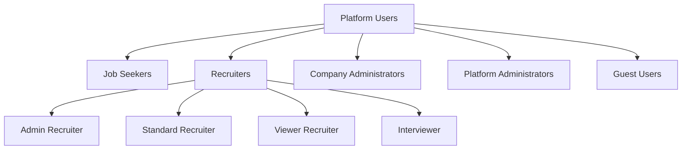

# Users Overview

The Job Portal platform supports multiple user types, each with specific roles, permissions, and constraints. This document provides a detailed overview of each user type and their interactions within the system.

## User Types at a Glance

## Job Seeker

### Description

Job seekers are individuals looking for employment opportunities through the platform.

### Key Capabilities

- Create and manage multiple resumes
- Search and apply for jobs
- Track application status
- Receive job recommendations
- Manage profile privacy
- Schedule interviews
- Bookmark interesting positions
- Toggle between local and global job listings

### Constraints

- Maximum of 50 active applications
- Must create resume before applying
- Cannot apply multiple times to the same job
- Can only withdraw applications before interview stage
- Limited visibility of other applicants

## Recruiter

### Description

Recruiters manage job postings and handle the recruitment process. There are four recruiter roles:

#### Admin Recruiter

- Full access to company's recruitment features
- Can manage other recruiters
- Access to all analytics and reports
- Can create and modify job templates

#### Standard Recruiter

- Can create and manage job postings
- Access to applicant data for own postings
- Basic analytics access
- Interview scheduling capabilities

#### Viewer Recruiter

- Read-only access to job postings
- Can view applicant profiles
- Limited analytics access
- No modification privileges

#### Interviewer

- Access to assigned candidate profiles
- Interview scheduling capabilities
- Can provide interview feedback
- Limited access to other recruitment features

### Key Capabilities

- Post and manage job listings
- Review applications
- Schedule interviews
- Communicate with candidates
- Access recruitment analytics
- Manage hiring pipelines
- Toggle between local and global job posting

### Constraints

- Role-based access restrictions
- Cannot edit closed job postings
- Must log all candidate interactions
- Limited to assigned geographical regions
- Cannot access competitor data

## Company Administrator

### Description

Company administrators manage the organization's presence and recruitment team on the platform.

### Key Capabilities

- Manage company profile
- Assign recruiter roles
- Set company-wide policies
- Access comprehensive analytics
- Manage subscription and billing
- Configure workflow templates

### Constraints

- Limited by subscription tier
- Maximum number of recruiter accounts
- Must maintain audit logs
- Geographic restrictions may apply
- Compliance with data protection laws

## Platform Administrator

### Description

Platform administrators manage the overall system and ensure its proper functioning.

### Key Capabilities

- System configuration
- User management
- Content moderation
- Platform monitoring
- Security management
- Support issue resolution

### Constraints

- Must log all administrative actions
- Cannot access private user data without authorization
- Subject to compliance requirements
- Limited production database access
- Must follow security protocols

## Guest User

### Description

Unregistered visitors who can access public features of the platform.

### Key Capabilities

- View public job listings
- Browse company profiles
- Access basic search features
- View platform documentation
- Register for an account

### Constraints

- No application privileges
- Limited search capabilities
- No access to advanced features
- Cannot contact recruiters directly
- Cannot save preferences

## User Permissions Matrix

| Feature              | Job Seeker | Recruiter (Admin) | Recruiter (Standard) | Recruiter (Viewer) | Interviewer | Company Admin | Platform Admin | Guest |
| -------------------- | ---------- | ----------------- | -------------------- | ------------------ | ----------- | ------------- | -------------- | ----- |
| View Public Jobs     | ✓          | ✓                 | ✓                    | ✓                  | ✓           | ✓             | ✓              | ✓     |
| Apply to Jobs        | ✓          | ✗                 | ✗                    | ✗                  | ✗           | ✗             | ✗              | ✗     |
| Post Jobs            | ✗          | ✓                 | ✓                    | ✗                  | ✗           | ✓             | ✓              | ✗     |
| Manage Applications  | ✗          | ✓                 | ✓                    | ✗                  | ✗           | ✓             | ✓              | ✗     |
| View Analytics       | Limited    | Full              | Limited              | Limited            | ✗           | Full          | Full           | ✗     |
| Manage Team          | ✗          | ✓                 | ✗                    | ✗                  | ✗           | ✓             | ✓              | ✗     |
| System Configuration | ✗          | ✗                 | ✗                    | ✗                  | ✗           | Limited       | Full           | ✗     |
| Toggle Profile       | ✓          | ✓                 | ✓                    | ✓                  | ✓           | ✓             | ✗              | ✓     |

## Data Access Levels

### Personal Data

- Job Seekers: Own data only
- Recruiters: Applicant data for assigned jobs
- Company Admins: Company-wide data
- Platform Admins: System-wide data with restrictions

### Analytics Data

- Job Seekers: Personal analytics
- Recruiters: Job posting and applicant analytics
- Company Admins: Company-wide analytics
- Platform Admins: Platform-wide analytics

## Security Considerations

### Authentication Requirements

- Strong password policies
- Two-factor authentication options
- Regular session management
- IP-based restrictions for admin access

### Activity Monitoring

- User action logging
- Security audit trails
- Suspicious activity detection
- Compliance monitoring

## Best Practices

### For Job Seekers

- Keep profile information updated
- Use appropriate privacy settings
- Follow application guidelines
- Maintain professional communication

### For Recruiters

- Regular pipeline updates
- Timely candidate communication
- Proper data handling
- Documentation maintenance

### For Administrators

- Regular security reviews
- Policy enforcement
- Team training
- Compliance maintenance

## Related Documentation

- [Job Seeker Guide](./job-seeker.md)
- [Recruiter Guide](./recruiter.md)
- [Company Administration](./company.md)
- [Platform Administration](./admin.md)
- [Security Guidelines](../07-guides/security.md)
