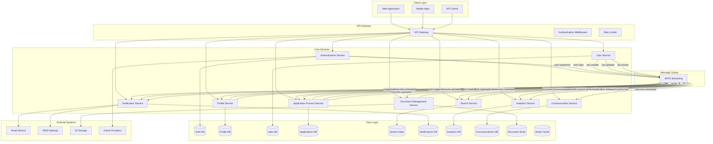

```mermaid
flowchart TD
    subgraph "Client Layer"
        WebApp[Web Application]
        MobileApp[Mobile Apps]
        API[API Clients]
    end

    subgraph "API Gateway"
        Gateway[API Gateway]
        Auth[Authentication Middleware]
        RateLimit[Rate Limiter]
    end

    WebApp --> Gateway
    MobileApp --> Gateway
    API --> Gateway

    Gateway --> AuthService
    Gateway --> ProfileService
    Gateway --> JobsService
    Gateway --> AppService
    Gateway --> SearchService
    Gateway --> NotifService
    Gateway --> AnalyticsService
    Gateway --> CommService
    Gateway --> DocService

    subgraph "Core Services"
        AuthService[Authentication Service]
        ProfileService[Profile Service]
        JobsService[Jobs Service]
        AppService[Application Process Service]
        SearchService[Search Service]
        NotifService[Notification Service]
        AnalyticsService[Analytics Service]
        CommService[Communication Service]
        DocService[Document Management Service]
    end

    subgraph "Message Queue"
        NATS[NATS Streaming]
    end

    AuthService -->|user.registered| NATS
    AuthService -->|user.login| NATS

    NATS -->|user.registered| ProfileService
    NATS -->|user.registered| NotifService

    ProfileService -->|profile.updated| NATS
    ProfileService -->|resume.uploaded| NATS

    NATS -->|profile.updated| SearchService
    NATS -->|resume.uploaded| DocService

    JobsService -->|job.created| NATS
    JobsService -->|job.updated| NATS
    JobsService -->|job.closed| NATS

    NATS -->|job.created| SearchService
    NATS -->|job.created| AppService
    NATS -->|job.closed| AppService

    AppService -->|application.submitted| NATS
    AppService -->|application.status.changed| NATS
    AppService -->|interview.scheduled| NATS

    NATS -->|application.submitted| AnalyticsService
    NATS -->|application.status.changed| NotifService
    NATS -->|interview.scheduled| NotifService
    NATS -->|interview.scheduled| CommService

    SearchService -->|search.performed| NATS
    NATS -->|search.performed| AnalyticsService

    DocService -->|document.processed| NATS

    subgraph "Data Layer"
        AuthDB[(Auth DB)]
        ProfileDB[(Profile DB)]
        JobsDB[(Jobs DB)]
        AppDB[(Applications DB)]
        SearchDB[(Search Index)]
        NotifDB[(Notifications DB)]
        AnalyticsDB[(Analytics DB)]
        CommDB[(Communications DB)]
        DocDB[(Document Store)]
        Cache[(Redis Cache)]
    end

    AuthService --> AuthDB
    ProfileService --> ProfileDB
    JobsService --> JobsDB
    AppService --> AppDB
    SearchService --> SearchDB
    NotifService --> NotifDB
    AnalyticsService --> AnalyticsDB
    CommService --> CommDB
    DocService --> DocDB

    subgraph "External Systems"
        EmailSvc[Email Service]
        SMSGateway[SMS Gateway]
        FileStorage[S3 Storage]
        OAuthProviders[OAuth Providers]
    end

    NotifService --> EmailSvc
    NotifService --> SMSGateway
    DocService --> FileStorage
    AuthService --> OAuthProviders
```
